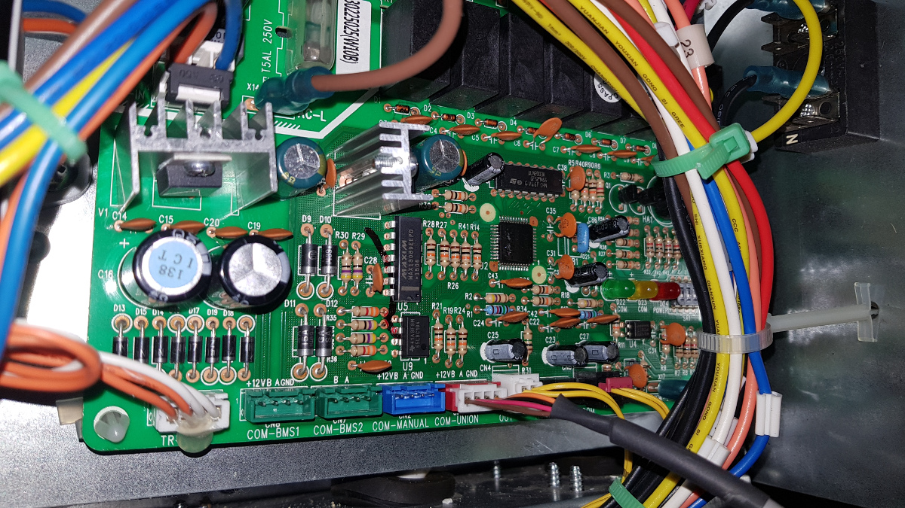

# FHBQ-D: Command Line Control for Heat Recovery Ventilators

This project provides a simple Python command-line interface to control FHBQ-D series Heat Recovery Ventilators (HRVs) found in units from manufacturers like Cooper & Hunter (C&H), Gree, and others, via the RS485 communication bus.

The implementation is based on reverse-engineering the protocol used by the control panel.

> ⚠️ Disclaimer
>
> Use this software at your own risk. Improper use may result in damage to your ventilation unit. The authors are not responsible for any damage or malfunctions that may occur.

## Compatibility

This tool is designed to work with units whose control board resembles the pictured board in the repository. If your board looks similar, you can proceed with testing.


## Prerequisites

- Python 3
- pyserial (install with `pip install pyserial`)
- USB → RS485 converter (physical interface to connect your computer, e.g., Raspberry Pi, to the HRV control board)

## Hardware connection

The HRV control board typically has two communication ports: `COM-MANUAL` and `COM-UNION`.

- One of these ports is used by the standard remote control panel.
- Connect the USB-RS485 converter to the remaining unused port.

Wiring:

- Connect the `A` terminal on the USB-RS485 converter to the `A` terminal on the control board port.
- Connect the `B` terminal on the USB-RS485 converter to the `B` terminal on the control board port.

Note: Ensure the serial device path in the script (default `/dev/ttyUSB0`) matches the port assigned to your converter.

## Usage

The control script is named `recuperator_cli.py`. It accepts commands as arguments, translates them into the appropriate RS485 packet, and sends them to the unit.

Run with `python3 recuperator_cli.py <command>`.

### 1) View help

To see a list of available operation modes, speeds, and bypass options:

```
python3 recuperator_cli.py help
```

### 2) Check current status

To check the current operating status of the HRV:

```
python3 recuperator_cli.py status
```

### 3) Turn off the HRV

To turn off the HRV:

```
python3 recuperator_cli.py off
```

### 4) Set operation mode, speed, and bypass

The script supports various combinations of operation modes, speeds, and bypass settings. For example:

- Normal mode, speed 1, bypass auto:

```
python3 recuperator_cli.py n 1 auto
```

- Save mode, speed 3, bypass off:

```
python3 recuperator_cli.py s 3 off
```

Refer to the `help` command for all valid combinations.

### 5) Send raw hex commands

For advanced users, raw hex commands can be sent directly to the HRV:

```
python3 recuperator_cli.py h <hex_string>
```

The `<hex_string>` must be exactly 34 characters long.

### 6) Use as a Python module

The script can also be used as a Python module by importing its functions into your own Python code. For example:

```python
from recuperator_cli import fhbq

# Check the current status of the HRV
status = fhbq('status')
print(status)

# Turn off the HRV
result = fhbq('off')
print(result)

# Set operation mode, speed, and bypass
result = fhbq('n', '1', 'auto')
print(result)
```

This allows you to integrate the HRV control functionality into larger Python applications.

### Examples of CLI Commands and Responses

Below are some examples of how to use the script via the command line and the corresponding responses:

```bash
pi@raspberrypi:~/FHBQ-D $ python3 recuperator_cli.py status
mode: off; speed: 0; bypass: n/a;

pi@raspberrypi:~/FHBQ-D $ python3 recuperator_cli.py n 1 auto
DONE

pi@raspberrypi:~/FHBQ-D $ python3 recuperator_cli.py n 3 auto
DONE

pi@raspberrypi:~/FHBQ-D $ python3 recuperator_cli.py status
mode: normal; speed: 3; bypass: auto;

pi@raspberrypi:~/FHBQ-D $ python3 recuperator_cli.py off
DONE

pi@raspberrypi:~/FHBQ-D $ python3 recuperator_cli.py status
mode: off; speed: 0; bypass: n/a;
```

### Notes

- The script includes retry logic for sending commands and verifying acknowledgments from the HRV.
- Debugging flags can be enabled in the script for detailed output during development or troubleshooting.
